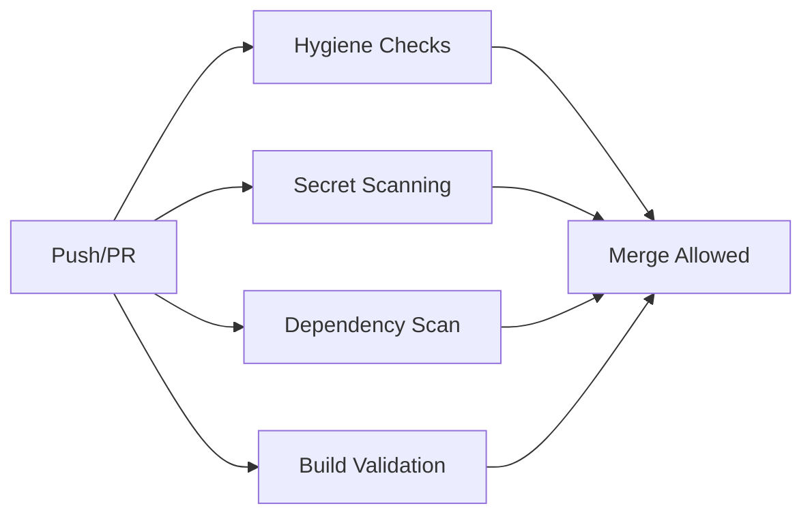

# PR-02: CI Guardrails & Repository Hygiene Automation

**Status**: ✅ Ready for Review  
**Date**: February 3, 2026  
**Author**: Staff Engineer  
**Priority**: P0 - Production Blocker

## Scope Summary

Prevent security regressions and repository pollution through automated CI checks. Make compliance a guardrail, not a guideline.

## Problem Statement

**Current Risk**: Discipline-based security fails under pressure. Developers can accidentally:

- Commit backup files (_.bak, _.old, \*.backup) with sensitive data
- Leave editor swap files in the repo
- Commit Supabase CLI temporary artifacts
- Expose secrets in code (API keys, tokens, passwords)
- Merge code with vulnerabilities
- Deploy code that doesn't build or type-check

**Solution**: Fail-closed automation that blocks merges before damage occurs.

## Implementation Details

### 1. Repository Hygiene Workflow

**File**: `.github/workflows/repo-hygiene.yml`

**Jobs**:

#### Job 1: Hygiene Checks

- **Block backup files**: Fails if `*.bak`, `*.old`, `*.backup`, `*.tmp` exist in repo
- **Block Supabase temp artifacts**: Fails if `supabase/.temp` or `supabase/.branches` committed
- **Block editor swap files**: Fails if `.swp`, `.swo`, `~` files committed
- **Warn on log files**: Warns if log files outside `docs/` are committed
- **Check large files**: Warns if files >1MB committed (suggests LFS/S3)
- **Verify .gitignore**: Ensures all critical patterns are covered

#### Job 2: Secret Detection (Gitleaks)

- **Scans full git history** for secrets
- **Custom rules** for ABR Insights:
  - Supabase service role keys (critical severity)
  - Stripe secret keys (critical severity)
  - Stripe webhook secrets (high severity)
  - Azure OpenAI keys (high severity)
  - Upstash Redis URLs (high severity)
  - Generic API keys (medium severity)
  - Private keys (critical severity)
  - JWT secrets (high severity)
  - Database connection strings (high severity)

#### Job 3: Dependency Security

- **npm audit**: Fails on high/critical vulnerabilities
- **Outdated check**: Reports outdated dependencies (info only)

#### Job 4: Build Validation

- **TypeScript type check**: Ensures no type errors
- **ESLint**: Ensures code style compliance
- **Production build**: Ensures code builds successfully

### 2. Gitleaks Configuration

**File**: `.gitleaks.toml`

**Features**:

- Uses Gitleaks default rules as baseline
- Custom rules for ABR Insights secrets
- Allowlist for documentation (can reference example secrets)
- Allowlist for test fixtures (can use dummy secrets)
- Allowlist for `NEXT_PUBLIC_*` vars (meant to be public)

**Severity Levels**:

- **Critical**: Service role keys, private keys, Stripe live keys
- **High**: Webhook secrets, Azure keys, Redis URLs, JWT secrets
- **Medium**: Generic API keys

## Files Changed

### New Files

1. **`.github/workflows/repo-hygiene.yml`** (258 lines)
   - Complete hygiene automation
   - 4 jobs: hygiene, secrets, dependencies, build
   - Fail-closed on violations

2. **`.gitleaks.toml`** (145 lines)
   - Gitleaks configuration
   - Custom rules for our stack
   - Allowlist for safe patterns

3. **`docs/PR_02_CI_GUARDRAILS.md`** (this file)
   - Complete PR documentation
   - Acceptance criteria
   - Rollback strategy

### Modified Files

None (existing workflows remain unchanged)

## Acceptance Criteria

### Automated Tests (CI)

- [ ] CI runs on every push to `main` and `develop`
- [ ] CI runs on every pull request
- [ ] Hygiene checks fail if backup files committed
- [ ] Hygiene checks fail if temp artifacts committed
- [ ] Secret scanning fails if secrets detected
- [ ] Dependency scan fails if high/critical vulnerabilities exist
- [ ] Build validation fails if type check fails
- [ ] Build validation fails if lint fails
- [ ] Build validation fails if build fails

### Manual Validation

```bash
# 1. Test backup file blocking
touch test.bak
git add test.bak
git commit -m "test: should fail in CI"
# Expected: CI fails with "Backup files detected"

# 2. Test secret detection (use fake secret)
echo 'const key = "sk_live_' > test-secret.ts
echo '51supplychainingkeyfrom1to51" // fake' >> test-secret.ts
git add test-secret.ts
git commit -m "test: should fail in CI"
# Expected: CI fails with "Stripe Secret API Key detected"

# 3. Clean up test files
git reset --hard HEAD~2
```

### Security Validation Checklist

- [ ] Backup files are blocked
- [ ] Temp artifacts are blocked
- [ ] Secrets are detected and blocked
- [ ] Vulnerabilities block merges
- [ ] Type errors block merges
- [ ] Lint errors block merges
- [ ] Build failures block merges

## Security Implications

### Attack Vectors Mitigated

1. **Secret Exposure**: Gitleaks prevents API keys, tokens, passwords from being committed
2. **Data Leakage**: Backup files often contain sensitive data (DB dumps, logs, etc.)
3. **Supply Chain**: npm audit blocks known vulnerable dependencies
4. **Runtime Errors**: Type checking prevents runtime type errors
5. **Code Quality**: Linting enforces security-aware patterns

### Compliance Benefits

- **SOC 2**: Automated controls for secret management
- **ISO 27001**: Code review automation, vulnerability management
- **GDPR**: Prevents accidental data exposure via backup files
- **PCI DSS**: Secret detection for payment API keys

### Risk Reduction

**Before PR-02**:

- Secrets could be committed (manual review required)
- Backup files could leak data
- Vulnerabilities could slip through
- Broken code could be merged

**After PR-02**:

- Secrets are automatically blocked (CI fails)
- Backup files are automatically blocked (CI fails)
- Vulnerabilities are automatically blocked (CI fails)
- Broken code is automatically blocked (CI fails)

## Rollback Strategy

### If CI Becomes Too Strict (False Positives)

1. **Adjust Gitleaks allowlist**:

```toml
# .gitleaks.toml
[[rules.allowlist]]
paths = [
  '''path/to/file\.ts''',
]
```

2. **Disable specific checks temporarily**:

```yaml
# .github/workflows/repo-hygiene.yml
# Comment out problematic job
# secret-scanning:
#   name: Secret Detection
#   ...
```

3. **Emergency bypass** (use sparingly):

```bash
# Skip CI checks for emergency fix
git commit -m "fix: emergency production issue [skip ci]"
```

### If Gitleaks Blocks Legitimate Code

**Example**: Test fixture needs a dummy JWT

```toml
# .gitleaks.toml - Add to allowlist
[[rules.allowlist]]
paths = [
  '''tests/fixtures/dummy-tokens\.ts''',
]
description = "Test fixtures with dummy tokens"
```

### Complete Rollback

```bash
# Remove PR-02 files
git rm .github/workflows/repo-hygiene.yml
git rm .gitleaks.toml
git rm docs/PR_02_CI_GUARDRAILS.md
git commit -m "revert: PR-02 CI guardrails"
git push origin main
```

## Testing Strategy

### Local Testing

```bash
# 1. Install Gitleaks locally
brew install gitleaks  # macOS
# or download from https://github.com/gitleaks/gitleaks

# 2. Run Gitleaks locally
gitleaks detect --source . --config .gitleaks.toml

# 3. Test with known secret pattern
echo 'sk_live_51_test_secret_key_12345' > test.txt
gitleaks detect --source . --config .gitleaks.toml
# Expected: Detects Stripe secret key

# 4. Clean up
rm test.txt
```

### CI Testing

```bash
# 1. Create a test branch
git checkout -b test-pr-02-ci

# 2. Test backup file blocking
touch test.backup
git add test.backup
git commit -m "test: backup file blocking"
git push origin test-pr-02-ci
# Check GitHub Actions - should fail

# 3. Test secret detection
echo 'const key = "sk_live_fake_key_12345"' > test.ts
git add test.ts
git commit -m "test: secret detection"
git push origin test-pr-02-ci
# Check GitHub Actions - should fail

# 4. Clean up
git checkout main
git branch -D test-pr-02-ci
git push origin --delete test-pr-02-ci
```

## CI/CD Integration

### Branch Protection Rules (Recommended)

Add to GitHub repository settings:

```yaml
Branch: main
Protection rules:
  ✅ Require status checks to pass before merging
    Required checks:
      - Repository Hygiene Checks
      - Secret Detection (Gitleaks)
      - Dependency Vulnerability Scan
      - Build & Type Check
  ✅ Require branches to be up to date before merging
  ✅ Require conversation resolution before merging
```

### Workflow Dependencies



All jobs must pass before merge is allowed.

## Success Metrics

### Pre-Merge

- [ ] All CI jobs pass on `main` branch
- [ ] Test commit with backup file fails CI
- [ ] Test commit with fake secret fails CI
- [ ] Clean commit passes all checks

### Post-Merge

- [ ] PR branch protection rules enforced
- [ ] No secrets committed in next 30 days
- [ ] No backup files committed in next 30 days
- [ ] No high/critical vulnerabilities merged
- [ ] 100% of PRs blocked by CI (when violations exist)

### Monitoring (30 days)

Track in GitHub Actions:

- Number of CI failures due to secrets
- Number of CI failures due to backup files
- Number of CI failures due to vulnerabilities
- Time to fix CI failures

## Documentation Updates

### Updated Files

1. **README.md** - Add badge for CI status
2. **CONTRIBUTING.md** - Document CI requirements
3. **docs/CONTAINER_SECURITY_CONTROLS.md** - Reference CI guardrails

## Next Steps (After PR-02 Merge)

1. **PR-03**: Structured Logging & Request Correlation
   - Replace `console.*` with structured logger
   - Add request_id to all API routes
   - Sanitize error messages

2. **PR-04**: Container Health & Metrics
   - Add `/healthz` endpoint
   - Add `/readyz` endpoint
   - OpenTelemetry integration

3. **PR-05**: AI Abuse & Cost Controls
   - AI usage tracking per org
   - Soft/hard quota enforcement
   - Admin UI for monitoring

## Questions & Answers

### Q: What if Gitleaks reports false positives?

**A**: Add the file path to `.gitleaks.toml` allowlist with a clear description.

### Q: Can we skip CI for emergency fixes?

**A**: Use `[skip ci]` in commit message, but this should be rare and documented.

### Q: What's the performance impact?

**A**: ~2-3 minutes added to CI runtime. Hygiene checks are fast (~30s), Gitleaks scan is ~60s, npm audit is ~30s.

### Q: Can developers run checks locally?

**A**: Yes. Install Gitleaks and run `gitleaks detect`. Use `npm run lint`, `npm run type-check`, `npm audit` locally.

### Q: What if a secret is already in git history?

**A**:

1. Immediately rotate the secret (change password, revoke API key)
2. Use `git filter-repo` to remove from history
3. Force push (coordinate with team)
4. Document in incident log

## Related PRs

- **PR-01**: CSP Runtime Enforcement (merged)
- **PR-03**: Structured Logging (next)
- **PR-07**: CanLII Compliance (hard rate limits)

## Sign-Off

**Required Approvals**:

- [ ] Security team (Gitleaks config, secret patterns)
- [ ] DevOps team (CI/CD workflows)
- [ ] Engineering lead (code review)

**Evidence Required Before Merge**:

- [ ] Screenshot of passing CI checks on clean commit
- [ ] Screenshot of failing CI when backup file committed
- [ ] Screenshot of failing CI when fake secret committed
- [ ] Branch protection rules configured

**Merge Conditions**:

1. All CI checks pass on this PR
2. Test validation complete (backup file, secret detection)
3. Branch protection rules documented
4. Sign-offs obtained
